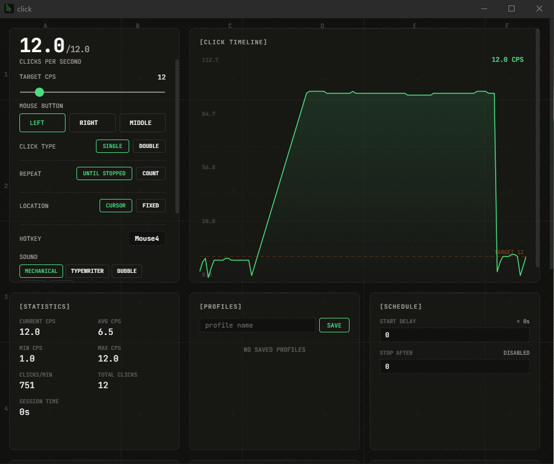

# Click



An autoclicker for Windows, built with Tauri v2, React, and Rust.

It does what OP Auto Clicker does but with a real UI -- live CPS charts, click heatmaps,
statistics, profiles, and anti-detection jitter (gaussian/poisson/uniform distributions).
The clicking engine runs entirely in Rust on a dedicated thread with sub-ms precision timing.

Beyond basic auto-clicking, it supports keyboard mode, click-and-hold, drag automation,
and multi-step sequences (chain clicks, keypresses, and waits together). You can save
and load profiles, import/export them as JSON, schedule start/stop times, and set position
jitter so clicks aren't all landing on the exact same pixel.

Minimizes to system tray. Default hotkey is F6, rebindable to any key including mouse4/mouse5.

## Download

Grab the latest exe from [Releases](../../releases).

## Building from source

Requires Node.js 18+ and Rust 1.75+.

```
npm install
npm run tauri dev     # dev mode with hot reload
npm run tauri build   # production build (.exe output)
```

## Keybinds

| Key | Action |
|-----|--------|
| F6 (default) | Toggle clicker on/off |
| Ctrl+1/2/3/4 | Switch mode: click/keyboard/hold/drag |
| Rebindable to F1-F12, any letter/number, Mouse4, Mouse5 |

## Stack

- **Frontend**: React 19, Zustand, Framer Motion
- **Backend**: Rust, windows-rs for input simulation, spin_sleep for precision timing
- **Framework**: Tauri v2 with global shortcut plugin, system tray
